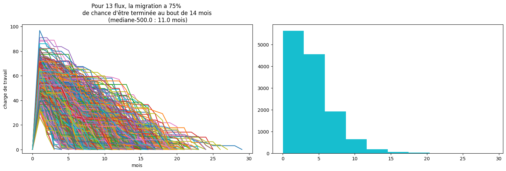

# Migration simulator
A monte carlo based simulation to evaluate an IT migration duration, costs, and impacts

## Simulation
* On mesure l'expérience sur 36 mois
* 1 itération = 1 mois
* l'équipe prend dans un backlog de X flux, 
   * ayant chacun une complexité suivant la suite de fibonacci [1, 2, 3, 5, 8, 13, 21]
   * le backlog contient une distribution de tickets plus ou moins complexe suivant une loi Gamma /\\_
   * le backlog commence d'abord par 3 flux complexes qui servent de pilotes
* la capacité à dépiler est égale à la taille de l'équipe / 3

* a combien de mois a-t-on fait 50/75 % du périmètre
* scénario alternatif : Combien de mois de blackout si on migre avec 100% des effectifs

### Ce qu'il faut retenir : 
Les chiffres ne sont pas des prédictions de ce qu'il se passera, ça reste une simulation simplifiant le problème; Ils montrent l'incertitude que ça peut avoir en jouant seulement sur 2 variables que sont le nombre de flux à migrer, et le nombre de personnes sur le projet.

## getting started

Prepare environnement

    python3 -m venv venv && source venv/bin/activate

Install package

    pip install -e .

## usage

```python:
    from montecarlo.migration import simulator
    from montecarlo.stat import describe, plot

    runs = 1000
    stream_num = 13
    result = simulator(
        runs, 
        stream_num,
        stream_workload=2.,
        workload_disturb=2.,
        people=13,
        capacity_rate=1/4
    )

    describe(result)
    plot(result)
```
Outputs : 

avg duration 11,  median duration 11.0,  75pct duration 14,  median stream workload 3.3602366165226454


